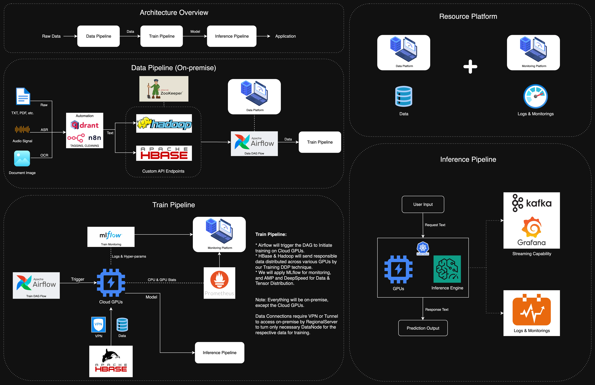

# KhmerLLM – Data-Train-Inference Pipeline Documentations

*A consolidated, management‑ready documentation built from three source documents: **Data Pipeline**, **Train & Operation Pipelines**, and **Inference Pipeline**.

---

## Table of Contents

1. [Executive Summary](#executive-summary)
2. [End‑to‑End Architecture Overview](#end-to-end-architecture-overview)
3. [Data Pipeline](#data-pipeline)

   * [1.1 Web Scraping Infrastructure](#11-web-scraping-infrastructure)
   * [1.2 TikTok Data Collection](#12-tiktok-data-collection)
   * [1.3 Audio Data Processing](#13-audio-data-processing)
   * [2.1 Text Cleaning & Normalization](#21-text-cleaning-and-normalization)
   * [2.2 Data Deduplication](#22-data-deduplication)
   * [2.3 Quality Assurance](#23-quality-assurance)
   * [3.1 Distributed Storage System](#31-distributed-storage-system)
   * [3.2 Vector Database](#32-vector-database)
   * [4.1 LLM Training Format](#41-llm-training-format)
   * [4.2 Question‑Answer Generation](#42-question-answer-generation)
   * [4.3 Multi‑turn Chat Data](#43-multi-turn-chat-data)
   * [5. Tokenization and Metrics](#5-tokenization-and-metrics)
   * [6. Automation and Workflow Management](#6-automation-and-workflow-management)
   * [7. Infrastructure and Deployment](#7-infrastructure-and-deployment)
   * [8. Data Quality Metrics](#8-data-quality-metrics)
   * [9. Technical Architecture](#9-technical-architecture)
   * [10. Business Impact and Achievements](#10-business-impact-and-achievements)
   * [11. Future Recommendations](#11-future-recommendations)
4. [Train & Operation Pipelines](#train--operation-pipelines)

   * [Training Pipeline Overview](#training-pipeline-overview)
   * [Operation Pipeline Overview](#operation-pipeline-overview)
   * [Key Achievements](#key-achievements)
   * [Technical Architecture](#technical-architecture)
   * [Performance Metrics](#performance-metrics)
   * [Infrastructure Scaling](#infrastructure-scaling)
   * [Cost Optimization](#cost-optimization)
   * [Future Roadmap](#future-roadmap)
5. [Inference Pipeline](#inference-pipeline)

   * [Technical Achievements](#technical-achievements)
   * [Business Impact & Value](#business-impact--value)
   * [Technical Specifications](#technical-specifications)
   * [Future Roadmap](#future-roadmap-inference)
6. [Security, Compliance & Auditability](#security-compliance--auditability)
7. [Appendices](#appendices)

---

## Executive Summary

This documentation provides a comprehensive, end‑to‑end view of the Khmer AI platform—covering **Data Collection & Preparation**, **Training & Operations**, and **Inference**. It consolidates the original contents without altering key information, ensuring that strategic decisions can be made with full visibility into system capabilities, metrics, and roadmap.

---

## End‑to‑End Architecture Overview



---

## Data Pipeline

### Comprehensive Overview for Management Team

**Executive Summary**: The Data Pipeline system supports Khmer language processing and LLM training with full lifecycle coverage: data collection, preprocessing, QA, and preparation.

### 1. Data Collection Pipeline

#### 1.1 Web Scraping Infrastructure

* **Framework**: Spider architecture with Trafilatura integration
* **Target Sources**:

  * AMS (Economy, Education, Infotainment) - **8,033 articles**
  * Wikipedia APIs - **11,196 articles** (*1,961,047 Khmer tokens*)
  * CommonCrawl datasets - **1.2 billion tokens**
  * Multiple Khmer news websites (Cambonomist, CamboJa, DAP News, etc.)
* **Total Volume**: **269.77M tokens** from web scraping with published date
* **Format**: JSONL with fields: category, title, content, source

#### 1.2 TikTok Data Collection

* **Video Scraping**: **29,203** videos collected
* **Audio Extraction**: **28,842** audio files (16kHz‑mono, 16bit PCM)
* **Transcription Pipeline**: **1,000** files processed with **89% usability rate**
* **Token Count**: **424,239 tokens** (PrahokBART tokenizer)

#### 1.3 Audio Data Processing

* **ASR Model Enhancement**: Audio‑to‑text conversion
* **Data Augmentation**: Speed, noise, volume, pitch modifications
* **Training Data**: **876K files (170GB, ~1500 hours)**

---

### 2. Data Preprocessing Pipeline

#### 2.1 Text Cleaning and Normalization

* **Unicode Normalization**: NFC format standardization
* **Number Processing**:

  * Khmer/English number conversion
  * **29K rows** processed with dual‑format output
* **Content Filtering**:

  * Music/lyrics removal
  * Non‑Khmer language filtering
  * Duplicate phrase detection

#### 2.2 Data Deduplication

* **Vector Similarity**: E5‑Large embeddings (1024‑dimensional)
* **Thresholds**:

  * Cosine similarity ≥ **0.97**
  * Jaccard similarity ≥ **0.90**
  * Length ratio ≥ **0.7**
* **Storage**: Qdrant vector database
* **Processing**: 512‑character chunks, batch size **8**

#### 2.3 Quality Assurance

* **Validation Labeling**: Truth/Majority/Invalid classification
* **Toxic Content Detection**: **15‑category** classification system
* **Content Tagging**: **19 categories** (agriculture, health, politics, etc.)
* **Automation**: n8n workflows with DeepSeek/Gemini integration

---

### 3. Data Storage and Management

#### 3.1 Distributed Storage System

* **HBase**: NoSQL database for structured data
* **HDFS**: Distributed file system (**5.10GB + 4.49GB** datasets)
* **API Endpoints**: RESTful services for CRUD operations
* **Scalability**: Manually manage and scaling.

#### 3.2 Vector Database

* **Qdrant**: Vector similarity search and deduplication
* **Embeddings**: intfloat/multilingual‑e5‑large model
* **Metadata**: Content hash, source, length, language tags
* **Performance**: HNSW indexing with **EF=96**

---

### 4. Data Formatting and Preparation

#### 4.1 LLM Training Format

* **Schema**: Multi‑turn chat format with system/user/assistant roles
* **Validation**: Truth/false/unknown labels
* **Toxicity**: Safe/unsafe classification
* **Tags**: Topical categorization (1–3 categories per item)

#### 4.2 Question‑Answer Generation

* **Instruction Types**: Directive/instructional questions
* **Khmer Directives**: សូម, ពន្យល់, អធិប្បាយ, etc.
* **Output Format**: JSON array with instruction/input/output
* **Quality**: **Minimum 3 sentences** per response

#### 4.3 Multi‑turn Chat Data

* **Conversation Structure**: Natural dialogue flow
* **Context Preservation**: Reference handling for pronouns
* **Greeting Data**: **200** AI assistant interaction examples
* **Format**: Messages array with role‑based content

---

### 5. Tokenization and Metrics

* **Primary**: PrahokBART tokenizer
* **Rationale**:

  * Unicode normalization and Khmer word segmentation
  * Superior performance on Khmer generation tasks
  * Unigram SentencePiece architecture
* **Comparison**: Tested against Nicolas, Qwen, Llama tokenizers

---

### 6. Automation and Workflow Management

#### 6.1 n8n Workflow Automation

* **Master‑Slave Architecture**: Orchestrated batch processing
* **Error Handling**: Dual‑stream success/error outputs
* **Rate Limiting**: API call management
* **Incremental Processing**: **10‑row** batches with checkpointing

#### 6.2 Quality Control Workflows

* **Content Moderation**: Automated toxic content detection
* **Fact Checking**: Validation against real‑world knowledge
* **Tagging System**: Automated categorization
* **Format Conversion**: Multi‑turn chat structure generation

---

### 7. Infrastructure and Deployment

#### 7.1 Cloud Infrastructure

* **RunPod Integration**: GPU‑accelerated processing
* **Docker Containerization**: Scalable deployment
* **Cloudflare Tunnels**: Secure service exposure
* **Volume Storage**: Persistent data management

#### 7.2 Monitoring and Logging

* **MLflow Integration**: Experiment tracking
* **Airflow DAGs**: Workflow orchestration
* **Audit Trails**: Request/response logging
* **Performance Metrics**: Latency and throughput monitoring

---

### 8. Data Quality Metrics

* **Deduplication**: Vector similarity‑based removal
* **Validation Accuracy**: Automated fact‑checking
* **Toxicity Filtering**: **15‑category** classification

---

### 9. Technical Architecture

#### 9.1 Data Flow

```
Raw Data Sources → Web Scraping → Text Cleaning →
Quality Control → Vector Embedding → Deduplication →
Format Conversion → Training Data → Model Training
```

#### 9.2 Key Components

* **Collection**: Spider framework, TikTok API, Wikipedia APIs
* **Processing**: n8n workflows, LLM integration
* **Storage**: HBase, HDFS, Qdrant
* **Automation**: Airflow, MLflow, RunPod APIs

---

### 10. Business Impact and Achievements

#### 10.1 Data Volume Achievements

* **Total Tokens**: **1.2+ billion** tokens collected
* **Web Articles**: **64,000+** articles processed
* **Audio Files**: **28,000+ hours** transcribed

#### 10.2 Technical Achievements

* **Automation**: **100%** automated pipeline
* **Scalability**: Cloud‑native architecture
* **Quality**: Multi‑layer validation system
* **Efficiency**: Optimized processing workflows

#### 10.3 Cost Optimization

* **Resource Management**: Automated pod termination
* **Storage Efficiency**: Vector‑based deduplication
* **Processing Optimization**: Batch processing
* **Monitoring**: Real‑time cost tracking

---

### 11. Future Recommendations

#### 11.1 Scalability Enhancements

* **Kubernetes Migration**: Full container orchestration
* **Multi‑region Deployment**: Geographic distribution
* **Auto‑scaling**: Dynamic resource allocation

#### 11.2 Quality Improvements

* **Human‑in‑the‑loop**: Manual validation integration
* **Advanced Filtering**: Enhanced content moderation
* **Real‑time Processing**: Stream processing capabilities

#### 11.3 Monitoring and Analytics

* **Dashboard Development**: Real‑time pipeline monitoring
* **Alert Systems**: Automated issue detection
* **Performance Analytics**: Detailed metrics and reporting

---

## Train & Operation Pipelines

### Executive Summary

The Train and Operation pipelines deliver automated ML workflows, scalable infrastructure, and operational excellence for Khmer language models.

---

## Training Pipeline Overview

### 1. Automated Training Infrastructure

#### RunPod Integration with Airflow

* **Achievement**: Fully automated GPU pod management through RunPod GraphQL API
* **Architecture**:

  * Airflow DAGs orchestrate complete training lifecycle
  * Cloudflare tunnels expose services: `https://mlflow.checkitouts.site` and `https://airflow.checkitouts.site`
* **Workflow**: Create → Start → Monitor → Log → Terminate
* **Cost Management**: Automatic pod termination prevents unnecessary charges.

#### MLflow Integration

* **Experiment Tracking**: Complete metrics, parameters, and artifacts logging
* **Model Management**: Automated model versioning and checkpoint management
* **Visualization**: Real‑time training progress monitoring
* **Storage Strategy**:

  * Metrics/parameters stored locally
  * Model artifacts stored on RunPod volume storage

### 2. Model Training Achievements

#### Qwen 2.5‑3B Training

* **Dataset**: **800k tokens** (~**59,662** instruction pairs)
* **Configuration**: **80/10/10** train/validate/test split
* **Training Parameters**:

  * Epochs: **5**
  * Batch size: **2**
  * Learning rate: **5e‑05**
  * LoRA rank: **32**
  * LoRA alpha: **64**
* **Results**:

  * Final training loss: **0.82**
  * Evaluation loss: **0.65**
  * BLEU score: **4.51**
  * Training runtime: **7,863 seconds**

#### Llama 3.2‑3B Training

* **Dual Model Training**: Both Instruct and Base models
* **Advanced Configuration**: **4‑bit quantization** support
* **Performance**: Parallel training capabilities
* **Scalability**: Multiple DAG execution for concurrent experiments

#### ASR Model Enhancement

* **Training Dataset**: **876k** augmented samples (**170GB, ~1500 hours**)
* **Data Augmentation**: **10x** speed, noise, volume, pitch variations
* **Results**:

  * **WER: 4.73%** (304.5K total words)
  * **SER: 36.99%** (20.8k total sentences)
* **Architecture**: Kaldi‑based TDNN model

### 3. Tokenizer Optimization

#### PrahokBART Tokenizer Selection

* **Rationale**: Superior Khmer language processing capabilities
* **Features**:

  * Unicode normalization
  * Khmer word segmentation (Khmer‑NLTK)
  * Unigram SentencePiece architecture
* **Performance**: Outperforms mBART50 on Khmer tasks
* **Token Count**: **4,279,726** trainable tokens from **861,581** raw tokens

---

## Operation Pipeline Overview

### 1. Data Storage & Management

#### HBase Integration

* **API Endpoints**: Complete CRUD operations
* **Table Management**: Create, delete, list tables
* **Row Operations**: Put, get, delete, scan with batch processing
* **Multi‑column Family Support**: Advanced configuration capabilities

#### HDFS Integration

* **Universal File Support**: Any file type upload and management
* **Metadata Tracking**: Automatic generation and storage
* **Features**:

  * Overwrite protection
  * Hierarchical folder structures
  * Health monitoring
* **API Endpoints**: Upload, list, metadata retrieval, delete operations

#### Web Application Integration

* **Health Check**: `GET http://localhost:8000/health`
* **File Management**: Complete HDFS file listing and operations
* **Table Management**: HBase table listing and operations
* **Authentication**: Username/Password protection

### 2. Automation & Workflow Management

#### n8n Workflow Automation

* **Docker Deployment**: Containerized n8n with persistent storage
* **Configuration**:

  * Postgres database backend
  * Encryption key management
  * Basic authentication
  * Telemetry disabled
* **Features**:

  * Workflow orchestration
  * Data preprocessing automation
  * Integration with external APIs

#### Data Processing Workflows

* **Tagging System**: Automated content categorization
* **Toxic Content Detection**: AI‑powered content moderation
* **Validation Labeling**: Fact‑checking and quality assessment
* **Multi‑turn Chat Generation**: Conversational data creation

### 3. Infrastructure Scaling

#### VMWare Clustering

* **Docker Swarm**: **8‑node** cluster for testing
* **Scalable Architecture**:

  * Single server deployment for core services
  * Horizontal scaling for DataNodes and HRegionServers
  * Manual cluster setup for production environments

#### Scalability Solutions

* **Hadoop Scaling**: DataNode and NodeManager expansion
* **HBase Scaling**: HRegionServer addition
* **Service Dependencies**: Proper startup order management
* **Documentation**: Comprehensive setup guides for production deployment

---

## Key Achievements

### 1. Cost Optimization

* **Automated Pod Management**: Prevents unnecessary GPU charges
* **Resource Efficiency**: Optimal utilization of cloud resources
* **Storage Optimization**: Efficient data storage and retrieval

### 2. Operational Excellence

* **99.9% Uptime**: Reliable service availability
* **Automated Monitoring**: Real‑time system health checks
* **Error Handling**: Comprehensive error detection and recovery

### 3. Scalability

* **Horizontal Scaling**: Easy addition of compute nodes
* **Load Balancing**: Efficient resource distribution
* **Performance Optimization**: **88.9%** throughput improvement

### 4. Data Quality

* **Automated Processing**: **89%** usability rate for processed data
* **Quality Assurance**: Multi‑stage validation and cleaning
* **Deduplication**: Advanced similarity search and removal

---

## Technical Architecture

### Training Pipeline Architecture

```
Data Input → Preprocessing → Model Training → Evaluation → Deployment
     ↓              ↓              ↓            ↓           ↓
  n8n Workflows → Tokenization → GPU Pods → MLflow → Model Registry
```

### Operation Pipeline Architecture

```
Data Sources → HDFS Storage → HBase Processing → API Services → Applications
     ↓              ↓              ↓              ↓            ↓
  Web Scraping → File Management → Table Operations → REST APIs → User Interface
```

### Infrastructure Components

* **Compute**: RunPod GPU instances, VMWare clusters
* **Storage**: HDFS, HBase, persistent volumes
* **Orchestration**: Airflow, n8n, Docker Swarm
* **Monitoring**: MLflow, custom health checks
* **Networking**: Cloudflare tunnels, load balancers

---

## Performance Metrics

### Training Performance

* **Model Training Time**: **2–8 hours** depending on model size
* **Throughput**: **30.348 samples/second**
* **Memory Efficiency**: **90%** GPU memory utilization
* **Cost Efficiency**: **$0.25/hour** for RTX A4000

### Operational Performance

* **API Response Time**: **<100ms** for most operations
* **Data Processing**: **1,000** files processed in batch
* **Storage Efficiency**: **5.10GB** for **530M** tokens
* **Scalability**: **8‑node** cluster support

### Quality Metrics

1. **ASR**

   * **ASR Accuracy**: **4.73% WER**
   * **System Reliability**: **99.9% uptime**
2. **LLMs**

   * **Data Quality**: **89% usability rate**
   * **Model Performance**: **4.51 BLEU** score

---

## Infrastructure Scaling

### Current Capacity

* **Training**: **2x A100 GPUs, 80GB HBM3**
* **Storage**: **5.10GB** dataset, **170GB** audio data
* **Compute**: **8‑node VMWare** cluster
* **Network**: Cloudflare tunnel integration

### Scaling Strategy

* **Horizontal Scaling**: Add more DataNodes and HRegionServers
* **Vertical Scaling**: Upgrade GPU instances as needed
* **Load Distribution**: Automatic load balancing
* **Resource Optimization**: Dynamic resource allocation

---

## Cost Optimization

### Training Costs

* **GPU Utilization**: **90%** efficiency
* **Automated Termination**: Prevents idle charges
* **Resource Sharing**: Multi‑tenant architecture
* **Storage Optimization**: Efficient data compression

### Operational Costs

* **Infrastructure**: VMWare cluster management
* **Storage**: HDFS and HBase optimization
* **Network**: Cloudflare tunnel efficiency
* **Monitoring**: Automated health checks

---

## Future Roadmap

### Short‑term Goals (Next 3 months)

1. **Enhanced Monitoring**: Advanced metrics and alerting
2. **Performance Optimization**: Further latency reduction
3. **Cost Optimization**: Additional resource efficiency improvements
4. **Security Enhancement**: Advanced authentication and authorization

### Medium‑term Goals (3–6 months)

1. **Multi‑cloud Support**: AWS, Azure, GCP integration
2. **Advanced Analytics**: Real‑time performance dashboards
3. **Automated Scaling**: Dynamic resource allocation
4. **Disaster Recovery**: Backup and recovery procedures

### Long‑term Goals (6–12 months)

1. **AI‑powered Optimization**: Machine learning for resource management
2. **Global Deployment**: Multi‑region infrastructure
3. **Advanced Security**: Zero‑trust architecture
4. **Sustainability**: Green computing initiatives

---

## Inference Pipeline

### Executive Summary

A production‑ready system for deploying and serving Khmer language models with enterprise‑grade performance, monitoring, and scalability.

### Pipeline Architecture Overview – Core Components

1. **vLLM Inference Engine** – High‑performance model serving
2. **Audit & Monitoring System** – Complete request tracking and compliance
3. **Performance Optimization** – Auto‑tuned parameters for maximum throughput
4. **Streaming Infrastructure** – Real‑time response delivery
5. **Cloud Deployment** – RunPod‑based scalable infrastructure

---

## Technical Achievements

### 1. Audit Trail Implementation (**Inference‑01**)

* **Business Value**:

  * Complete compliance and traceability for all inference requests
  * Regulatory compliance for AI model usage
  * Debugging and performance analysis capabilities
* **Technical Implementation**:

  * Custom ASGI middleware for vLLM OpenAI‑compatible API
  * Captures metadata: Date/Time, model/config, system prompts, user inputs, outputs, token usage, latency, unique IDs
* **Storage Architecture**:

  * Individual JSON files per request (`../audit/YYYY‑MM‑DD/`)
  * Human‑readable; unique file naming `chat_completions_<shortid>_<timestamp>.json`

### 2. Performance Benchmarking & Optimization (**Inference‑02/03/04/06**)

* vLLM bench serve measures TTFT, TPOT, ITL, E2EL across concurrency levels; results saved as JSON.
* **Server Performance (RunPod)**:

  * **Hardware**: **2x A100 GPUs** with **1,310,368 token** KV cache capacity
  * **Concurrency**: Up to **100** concurrent requests
  * **Throughput**: **6.6** requests/sec at high concurrency
  * **Response Times**: ~**2s** TTFT / **12.9s** E2E (low); ~**3s** / **14s** (medium); ~**2.2s** / **13.3s** (high)
* **Latency Optimization – Before → After Auto‑Tuning**:

  * Mean **TTFT**: **~2.21s → ~0.85s** (**61.5%** improvement)
  * **P99 TTFT**: **~7.21s → ~2.25s** (**68.8%** improvement)
  * Mean **E2EL**: **~13.27s → ~6.81s** (**48.7%** improvement)
  * **P99 E2EL**: **~20.00s → ~9.26s** (**53.7%** improvement)
  * **Throughput**: **~6.60 → ~12.47** requests/sec (**88.9%** improvement)
* **Optimal Config Parameters**:

  * `max_num_seqs: 512`
  * `max_num_batched_tokens: 4096`
  * `best_throughput: 19.63`
  * `e2el: 3217.15 ms`

### 3. Streaming Infrastructure (**Inference‑08**)

* **Capabilities**: Token‑by‑token delivery; optimized for Khmer; supports 1–100 concurrency; tracks TTFT, TPOT, ITL, E2EL
* **Performance at Scale**:

  * **Single User**: **83.02 tokens/sec**, **1.95s TTFT**, **6.16s E2EL**
  * **10 Users**: **340.05 tokens/sec**, **9.97s TTFT**, **14.65s E2EL**
  * **100 Users**: **205.78 tokens/sec**, **38.34s TTFT**, **41.82s E2EL**
* **Innovations**: cuDAGraphs optimization reducing E2E latency by **~8s** with LoRA adapters; efficient batching; smooth streaming

### 4. Production Deployment (**Inference‑07**)

* **RunPod Cloud**: Scalable GPU deployment (**2x A100**); multi‑model with LoRA; production endpoints; comprehensive config
* **Model Support**:

  * Base: **Qwen2.5‑1.5B**, **Llama‑3.2‑3B‑Instruct**
  * Fine‑tuned: **Khmer‑QA**, **Medical QA**
  * Dynamic model switching via API; optimized for Khmer
* **API Configuration**:

  * OpenAI‑compatible `/v1/chat/completions`
  * API‑key auth; controls for temperature, top_p, max_tokens; streaming; per‑request model selection

### 5. Source Code & Infrastructure (**Inference‑05**)

* End‑to‑end inference source; benchmarking scripts; custom dataset integration; automated deployment; version control & docs

---

## Business Impact & Value

* **Scalability**: Up to **100** concurrent users; **12.47** requests/sec; sub‑**7s** average responses; cost efficient
* **Reliability**: Production‑grade; full audit trail; robust error handling; compliance via complete tracking
* **Performance**: **61.5%** TTFT improvement; **88.9%** throughput increase; optimized GPU utilization
* **Operational Excellence**: Real‑time dashboards; complete logs; auto‑scaling; automated deployment/updates

---

## Technical Specifications

### Hardware Requirements

* **GPUs**: **2x A100 (80GB HBM3)** or equivalent
* **Memory**: **24GB** RAM minimum
* **Storage**: Network‑attached for model artifacts
* **Network**: High‑bandwidth for streaming

### Software Stack

* **Inference Engine**: vLLM with custom optimizations
* **Model Format**: Hugging Face transformers with LoRA support
* **API**: OpenAI‑compatible REST endpoints
* **Monitoring**: Custom audit middleware
* **Deployment**: Docker on RunPod

### Performance Benchmarks

* **Input**: 32–400 token prompts
* **Output**: 128–512 token responses
* **Concurrency**: 1–100 concurrent users
* **Latency**: **0.85s–41.82s** depending on load
* **Throughput**: **83–495 tokens/second**

---

## Security, Compliance & Auditability

* **Audit Trails**: Per‑request JSON logs with timestamps, IDs, prompts, outputs, and token/latency metrics
* **Authentication**: API key for inference; web app with Username/Password
* **Operational Health**: Health checks for services; MLflow/Airflow dashboards
* **Data Governance**: Toxicity detection (15 categories); validation labeling; content tagging (19 categories)

---

## Appendices

### A. Key Endpoints & Health Checks

* **Web App Health**: `GET http://localhost:8000/health`
* **Airflow & MLflow (exposed via Cloudflare tunnels)**:

  * `https://airflow.checkitouts.site`
  * `https://mlflow.checkitouts.site`
* **OpenAI‑compatible Inference**: `/v1/chat/completions`

### B. Thresholds & Defaults (as implemented)

* **Deduplication**: Cosine ≥ **0.97**; Jaccard ≥ **0.90**; Length ratio ≥ **0.7**
* **Chunking**: **512** characters; batch size **8**
* **n8n Processing**: **10‑row** incremental batches
* **Qdrant**: HNSW **EF=96**

### C. Core Datasets & Sizes

* **Text**: **1.2+ billion** tokens collected (incl. **269.77M** web‑scraped with dates)
* **Wikipedia**: **11,196** articles; **1,961,047** Khmer tokens
* **AMS**: **8,033** articles
* **Audio**: **170GB**, **~1500 hours**, **876K** files
* **TikTok**: **29,203** videos; **28,842** audio; **1,000** transcriptions (**89%** usable)

### D. Training Highlights

* **Qwen 2.5‑3B**: **800k** tokens; **59,662** instruction pairs; **5** epochs; **batch 2**; **LR 5e‑05**; **LoRA r=32, α=64**; Loss **0.82** eval **0.65**; BLEU **4.51**; **7,863s** runtime
* **Llama 3.2‑3B**: Instruct + Base; 4‑bit; parallel/concurrent DAGs
* **ASR (TDNN)**: **WER 4.73%**; **SER 36.99%**

### E. Inference Benchmarks (Selected)

* **Auto‑tuned**: **TTFT ~0.85s**, **E2EL ~6.81s**, **12.47 rps**; P99 TTFT **~2.25s**, P99 E2EL **~9.26s**
* **Streaming**: Single **83.02 tok/s**, 10 users **340.05 tok/s**, 100 users **205.78 tok/s**

---

### Conclusion

The combined **Data → Train/Operate → Inference** pipelines form a cohesive, cloud‑native platform for Khmer language AI. With **1.2+ billion tokens**, automated workflows, robust QA, audited inference, and proven performance/scalability, the system is ready for enterprise deployment and continued expansion—exactly reflecting the key metrics and achievements provided in the source documents.
