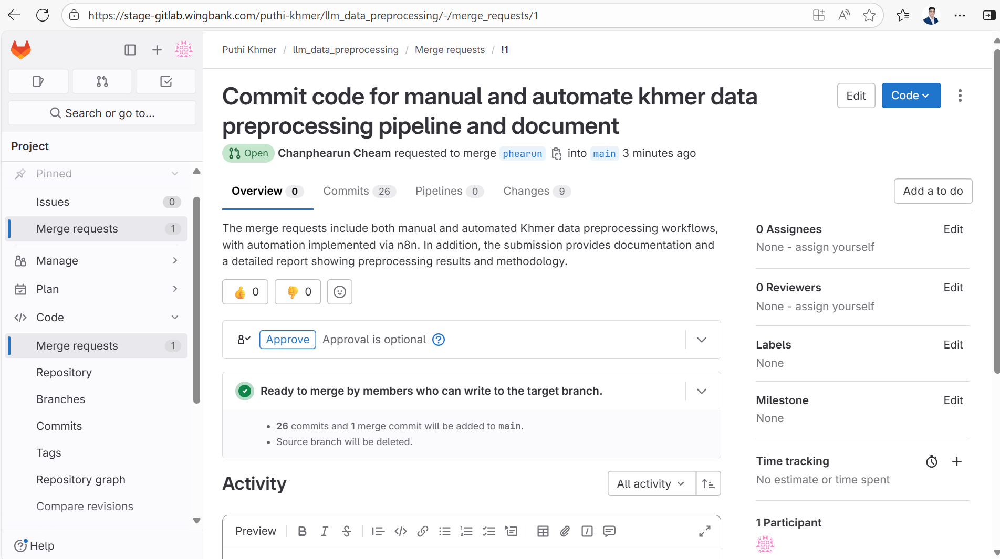

# [Data] Source Code management for Data Manual Cleaning B

* Purpose: To commit code and documentation of Khmer data preprocessing workflows into the main branch, including both manual scripts and automated pipelines using n8n. 
* Outcome:  


