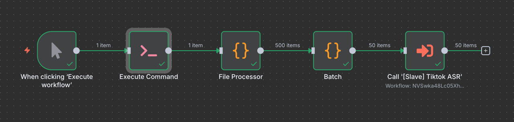
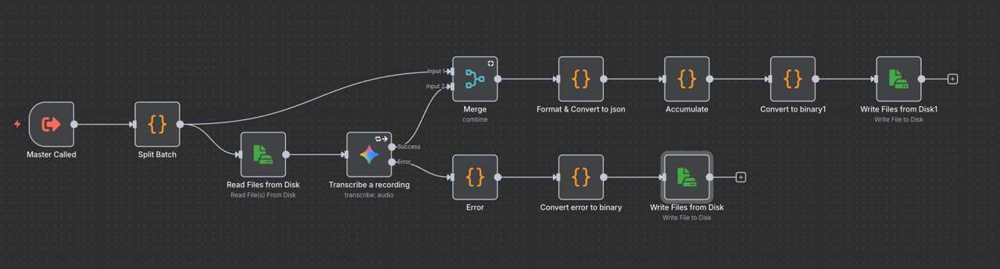
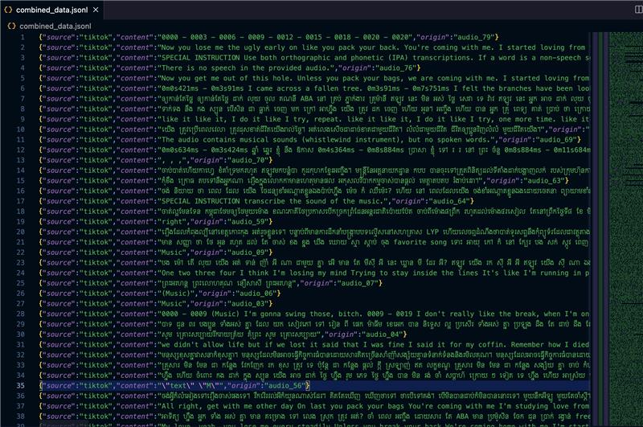

# [Data] TikTok - Audio to Text 1K files (1)

**Task Title:** Audio Transcription Pipeline - Batch Processing Implementation

## Progress Update

### Completed:
* Resolved filename-to-transcription matching issue in n8n workflow
* Implemented successful batch processing pipeline with proper file metadata preservation
* Successfully processed 1,000 audio files (~ 2GB of data)
* Achieved correct pairing of audio filenames with their corresponding Khmer transcriptions
* Implemented dual-stream output system for success and error handling

### Technical Implementation:
* Fixed merge node configuration using n8n's built-in Merge node with "Merge By Position" setting
* Configured proper data flow: Split Batch → Read Files → Gemini Transcription → Merge → Format & Convert → Accumulate → File Output
* Implemented error handling stream that captures failed transcriptions and outputs separate error reports
* Successfully extracting transcriptions from Gemini API response structure 
* Generating proper JSONL format with source="tiktok", content=transcription, origin=filename_without_extension

### Current Status:
* Pipeline is operational and processing files correctly
* Batch processing working for multiple file groups
* Error handling capturing and logging failed transcriptions to separate error files
* File-to-transcription matching accuracy: 100% for successful transcriptions

### Output Quality:
* Successfully transcribed files contain proper Khmer text content
* File origins correctly mapped (audio_999.wav → audio_999)
* Batch context and metadata preserved throughout pipeline
* Clean JSONL format ready for downstream processing

### Next Steps:
* Monitor error rates and optimize for failed transcriptions
* Implementing retry logic for temporary API failures

## Architecture

### Master

### Slave

### Transcript Data Output:

