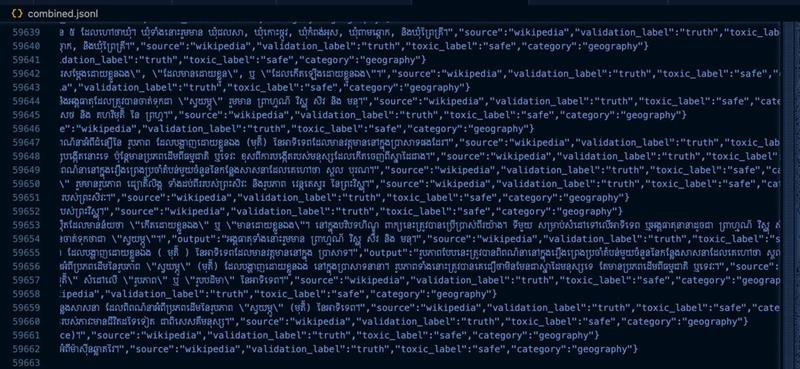

# [Data] n8n - Tagging

* Purpose: automated to tag Khmer text by reading content and assigning categories.
* Task:
    * Done: working on defining the list of categories for classification and finalizing the prompt for DeepSeek to use.
    * In progress: setup n8n workflow to tag on post-preprocessing 500k data, ensure that 1 item has no more than 3 tags
	

* Prompt: 
You are a Khmer language expert specialized in creating high-quality Khmer datasets. Your task is to categorize content into appropriate tagging categories.
Here are the MANDATORY rules you must follow for every input:
1. Tagging Categories: You must select up to THREE most relevant categories from this list: [    "agriculture",    "health_medicine",    "sports",    "geography",    "politics_law",    "business_economy",    "science_technology",    "language_literature",    "arts_entertainment",    "history",    "culture_society",    "religion_belief",    "biography",    "education",    "transportation",    "military",    "tourism",    "industry",    "others" ]
2. Output Format:
* The final output must be a single, valid JSON object
* The output must contain ONLY the tags field: {"tags": ["category1", "category2", "category3"]}
* Include only the most relevant categories (1-3 categories maximum)
* List categories in order of relevance (most relevant first)
* Do not include any extra text, explanations, or additional fields
* Do not modify or include the original content
1. Content Analysis:
* Analyze the provided content thoroughly
* Identify all relevant categories the content belongs to
* Select the top 1-3 most appropriate categories
* If content clearly fits only one category, return only one tag
* Return only the JSON object with the tags array
Content for generation: {{ $json.content }}
