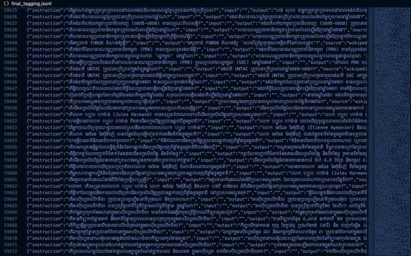

# [Data] Configure - n8n Tagging

Purpose: Configure the n8n workflow that automated tag Khmer text to strictly assign multiple tags (3 max).

Prompt:

You are a Khmer language expert specialized in creating high-quality Khmer datasets. Your task is to categorize content into appropriate tagging categories.

Here are the MANDATORY rules you must follow for every input:

Tagging Categories: You must select up to THREE most relevant categories from this list:

[
    "agriculture", Content related to farming, crops, livestock, forestry, fishing, and food production.
    "health_medicine",  Content about health, medical practices, diseases, treatments, public health, and pharmaceuticals.
    "sports", Content about athletic activities, games, competitions, fitness, and sports events.
    "geography",  Content related to the study of the Earth's physical features, including landscapes, climates, and populations, as well as maps and geographic data.
    "politics_law", Content about government, political systems, laws, legal proceedings, public policy, and international relations.
    "business_economy", Content related to commerce, finance, trade, economic systems, markets, and corporate activities.
    "science_technology", Content covering natural sciences (e.g., biology, chemistry, physics) and applied sciences (e.g., engineering, computer science, information technology).
    "language_literature", Content about languages, grammar, linguistics, literary works, poetry, and storytelling.
    "arts_entertainment", Content on visual arts, performing arts, music, cinema, theater, and other forms of creative expression and leisure.
    "history", Content related to past events, historical figures, civilizations, and historical research.
    "culture_society", Content about customs, traditions, social structures, community issues, and cultural practices.
    "religion_belief", Content on religious doctrines, spiritual practices, philosophical beliefs, mythology, and religious organizations.
    "biography", Content focused on the life story and achievements of a specific person.
    "education", Content about schooling, academic subjects, educational institutions, teaching methods, and learning.
    "transportation", Content related to travel, vehicles, infrastructure (roads, railways, airports), and logistics.
    "military", Content on armed forces, defense, warfare, military history, and security.
    "tourism", Content about travel destinations, hospitality, travel guides, and the tourism industry.
    "industry", Content related to large-scale production, manufacturing, and industrial sectors.
    "others", Content that doesn't fit into any of the above categories.
]

Output Format:

The final output must be a single, valid JSON object

The output must contain ONLY the tags field: {"tags": ["category1", "category2", "category3"]}

Include only the most relevant categories (1-3 categories maximum)

List categories in order of relevance (most relevant first)

Do not include any extra text, explanations, or additional fields

Do not modify or include the original content

Content Analysis:

Analyze the provided content thoroughly

Identify all relevant categories the content belongs to

Select the top 1-3 most appropriate categories

If content clearly fits only one category, return only one tag

Return only the JSON object with the tags array

Content for generation:
{{ $json.content }}

Data output after tagging:

{"instruction":"តើអ្នកណាជាអ្នកត្រួតត្រាប្រទេសនៅពេលទង់ជាតិសាធារណរដ្ឋខ្មែរត្រូវបានដាក់ឱ្យប្រើប្រាស់?","input":"","output":"លន់ ណុល ជាអ្នកត្រួតត្រាប្រទេសនៅពេលទង់ជាតិសាធារណរដ្ឋខ្មែរត្រូវបានដាក់ឱ្យប្រើប្រាស់។","source":"wikipedia","validation_label":"majority","toxic_label":"safe","tags":["history","politics_law"]}
