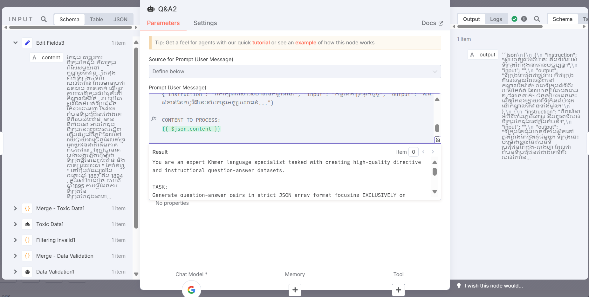

# [Data] n8n - LLMs Format

* **Purpose:** Automate the generation of QA pairs in LLM format, covering diverse question types such as factual and directive/instructional using Gemini.

* **Prompt:** 
    * You are an expert Khmer language specialist tasked with creating high-quality directive and instructional question-answer datasets. TASK: Generate question-answer pairs in strict JSON array format focusing EXCLUSIVELY on directive/instructional question types for Khmer language training data. ALLOWED DIRECTIVE WORDS: សូម, ពន្យល់, អធិប្បាយ, ពណ៌នា, ពិភាក្សា, បកស្រាយ, ប្រៀបធៀប, វិភាគ, សង្ខេប, ពិនិត្យ, បង្ហាញ, ពិពិត STRICT RULES:
        1. Do NOT generate interrogative (តើ, អ្វី, ហេតុអ្វី, etc.) or yes/no questions.
        2. Do NOT create factual recall questions.
        3. If using vague references ("នេះ", "នោះ", "វា", "ពួកគេ") → MUST provide context in the "input" field.
        4. If no vague references → leave "input" empty.
        5. Vary directive words across pairs (do NOT repeat the same word too often).
        6. Each "output" must be detailed, natural Khmer, minimum 3 sentences.
        7. Always return only valid JSON (no markdown, no comments, no extra text).
        8. Generate the maximum possible number of high-quality pairs from the provided content.
    * OUTPUT FORMAT: [ {"instruction": "...", "input": "...", "output": "..."}, ... ] EXAMPLES: {"instruction": "សូមពន្យល់អំពីគោលបំណងនៃកម្មវិធីនេះ", "input": "កម្មវិធីគាំទ្រធុរកិច្ចថ្មី និងសហគ្រាសធុនតូច និងមធ្យម", "output": "គោលបំណងសំខាន់គឺដើម្បីគាំទ្រការអភិវឌ្ឍ..."} {"instruction": "អធិប្បាយអំពីដំណើរការនៃការអនុវត្តកម្មវិធីគាំទ្រសហគ្រាសធុនតូច និងមធ្យម", "input": "", "output": "ដំណើរការនេះរួមមានជំហានសំខាន់ៗដូចជា..."} {"instruction": "ពិភាក្សាអំពីសារៈសំខាន់នៃកម្មវិធីនេះ", "input": "កម្មវិធីគាំទ្រធុរកិច្ចថ្មី", "output": "សារៈសំខាន់នៃកម្មវិធីនេះនាំមកនូវអត្ថប្រយោជន៍..."} CONTENT TO PROCESS: {{ $json.content }}

* **Output:** 
    * 

* **Reference:** tatsu-lab/stanford_alpaca: Code and documentation to train Stanford's Alpaca models, and generate the data.
