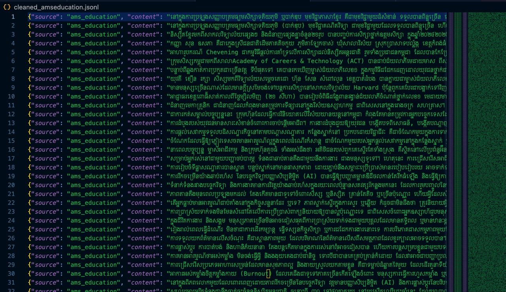

# Data AMS Education Web Scraping

Task: To scrape text data from ams education website articles using the Spider framework and Trafilatura. The data will be stored in JSONL format with the following fields: category, title, content, and source.

Total articles: 698 articles

Token: Pending (waiting phearun to finalize on tokenize method)

