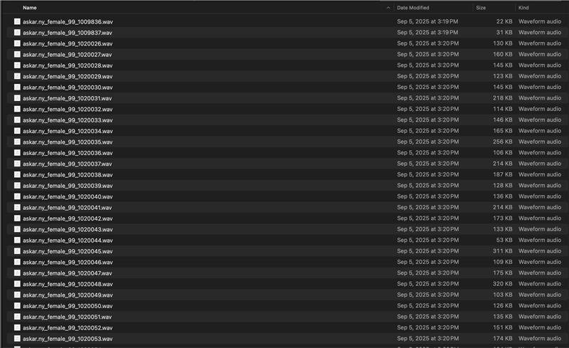

# [Audio] ASR Model Enhancement - Training - Data Processing

Text data processing is done. First, ran `local/gen_training_data_from_csv.py` on csv dataset to tokenize khmer text, clean transcription, format for kaldi in TSV, and normalizes file paths by making them lowercase and removing spaces.

Then ran `local/clean_khm_text.py` on `dataset/text` to remove unicode bomb char, punctuation, normalize whitespace, converts text to lowercase and remove short utterances. (see attached image below)

Audio file processing is already done beforehand by Nakhim

