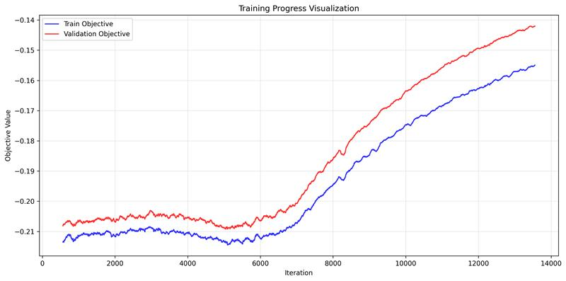

# [Audio] ASR Model Enhancement - Training - Train

Note: skip modifying lexicon.txt and stuff for code switching and train directly

## Setup
Setup the kaldi container and mount project

merge test and dev text with the 876k augmented training text

## Start training:
- **stage 0**: data preparation
- **stage 1**: dict formatting
- **stage 2**: language model preparation
- **stage 3**: mfcc feature extraction
- **stage 4**: gmm model training
- **stage 5**: tdnn model training
- **stage 6**: decode and evaluation

## Results

### First training
(for 20 epoch, batch size 256, mainly default config so we have a clear baseline):
* **4.73 WER** (304.5K total words)
* **36.99 SER** (20.8k total sentences)

Train and valid objective plot:

### Second training
(for 50 epoch, same setup as above) best WER is 5.54 so we will use first training model instead.
