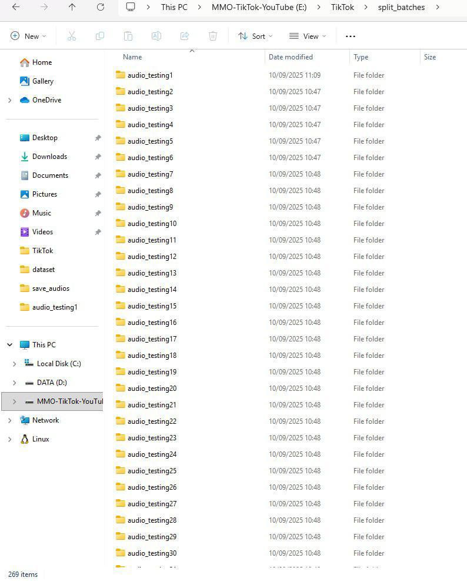
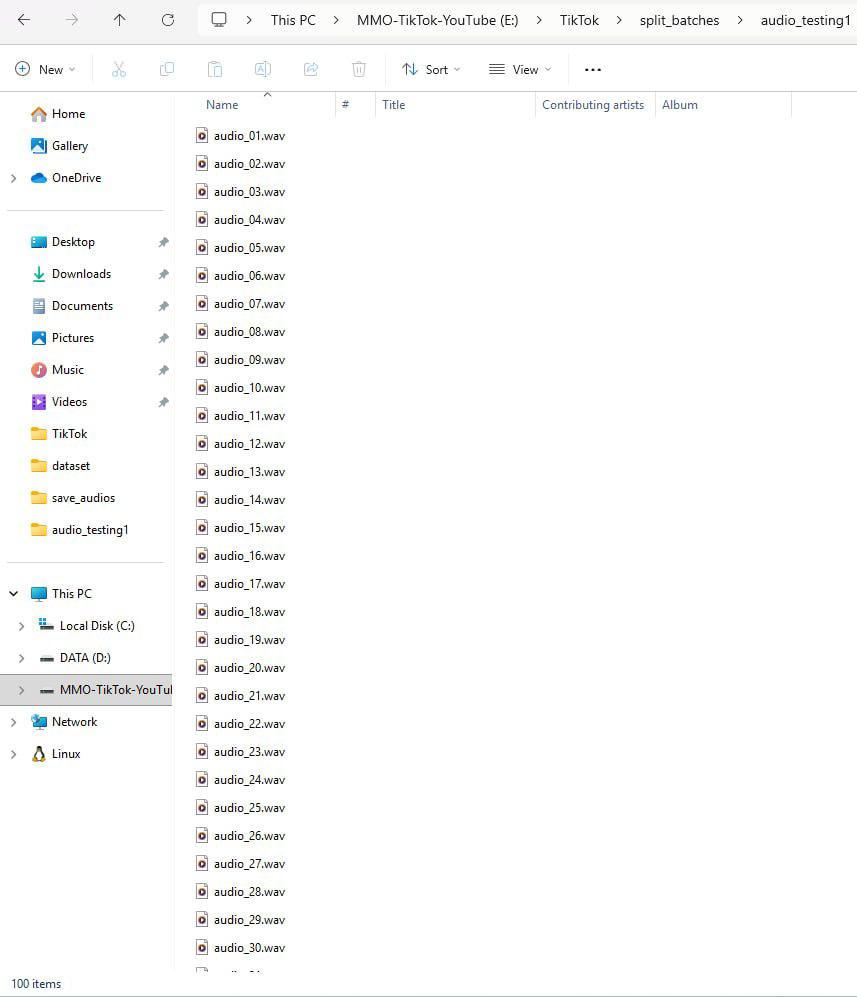

# TikTok - Automate Cleaning Audio and Batch Splitting 1K files (1)

* Resampling audio rate into the standard rate: 16khz-mono and 16bit PCM is the best for ASR
* File type filtering uses file extension to identify valid audio file, non-audio files are removed
* For each valid audio file, uses the pydub library to load the file and measure its duration
* If the audio file is shorter than 20s, it deletes the file
* Before cleaning the audio file in total is 28,842 audios
* After cleaning the audio file is only 26,880 audios
* After cleaning the audio file, it has been split into multiple folders (batch). Splits the list of audio files into chunks based on file size of 1 GB or a little bit more than 1 GB is ready for pushing into n8n webhooks for transcription
* Filtering audio output from Gemini that has error into the new one folder and then pushing it again into n8n for transcription
