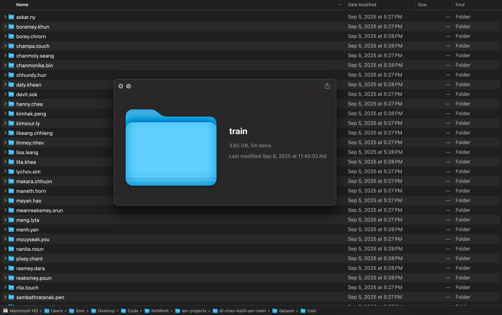
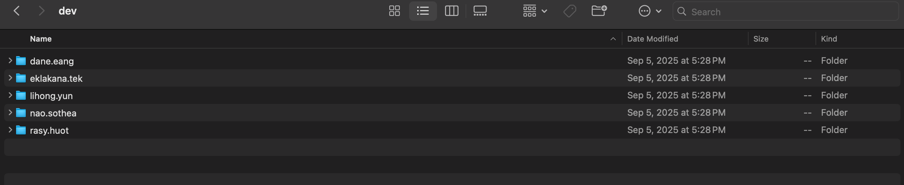
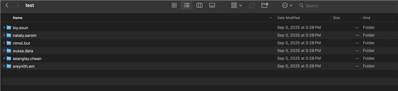

# [Audio] ASR Model Enhancement - Training - Data Splits

Manually split audio file into train, dev, test inside dataset folder using 80/10/10 ratio

Total audio files = 26442

→ train = 21082 audio files

→ dev = 2683 audio files

→ test = 2677 audio files

