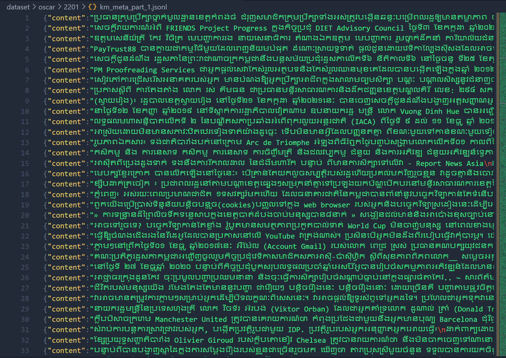

# [Data] CommonCrawl Web Scraping (1)

* Purpose: Extract Raw Khmer content from CommonCrawl which already crawl from multiple khmer website.
* Outcome: 
    * Collecting Khmer Dataset from Oscar (Common Crawl 2201 and Common Crawl 2301).
        * Estimated Token Count (PrahokBart Tokenizer): 530 million token. 
        * File Size: 5.10GB
        * Image: 

 
    * Collecting Khmer Dataset From C4 (Colossal Clean Crawled Corpus). Mostly data from 2012-2022.
        * Estimated Token Count (PrahokBart Tokenizer): 490 million token. 
        * File Size: 4.49GB
        * Image: 

Total Estimate Token: 1.2 billion tokens
