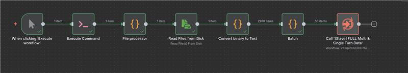
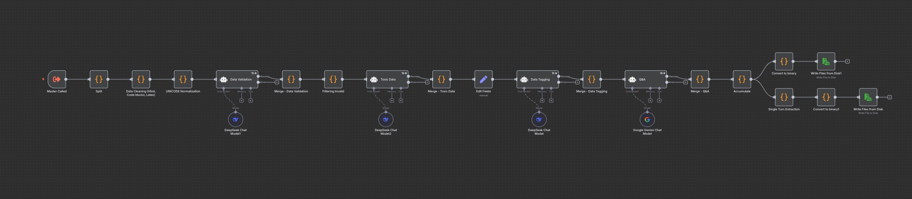

# [Data] n8n - Revise Structured Data for Multi-turn Chat models

The task is to revise the n8n workflow to generate a multi-turn chat data structure and to generate a single chat data structure from multi-turn output.

## Master workflow:

## Slave workflow:

