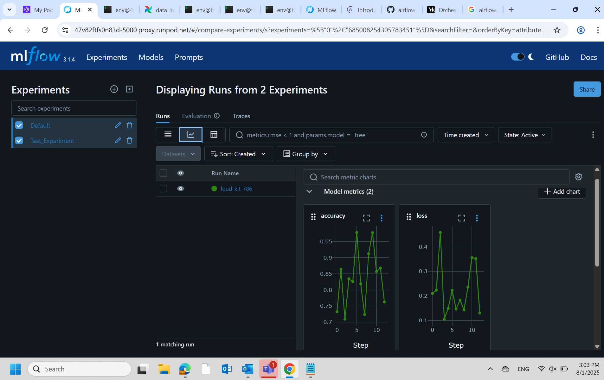

# [Train] RunPod - Training Stacks - MLflow

Direct deploy MLflow on RunPod
* Setup and install dependencies directly in the RunPod.
* Testing simple training scripts with MLflow to tracking experiments.

Run MLflow in Docker locally
* Set up MLflow services in Docker.
* Use Cloudflare to expose the MLflow port: 
    * Setup & config to expose the MLflow port.
* Testing with the training source code.
* Cloudflare limit, can't use the post API for uploading all the model artifacts/logs into the host storage of the MLflow. 
