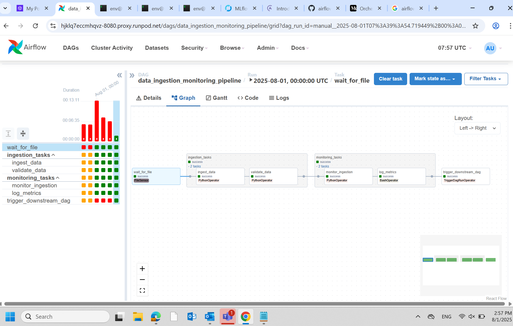
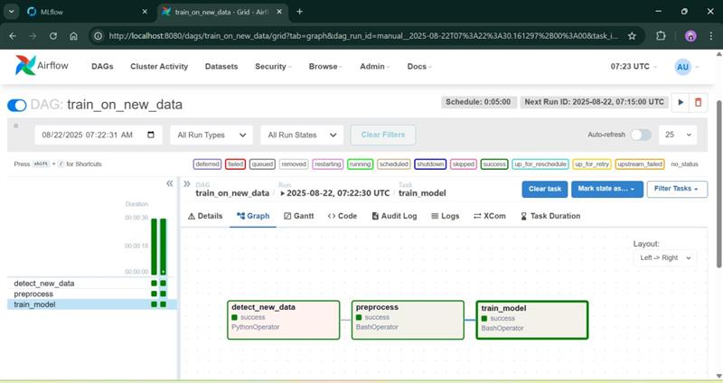
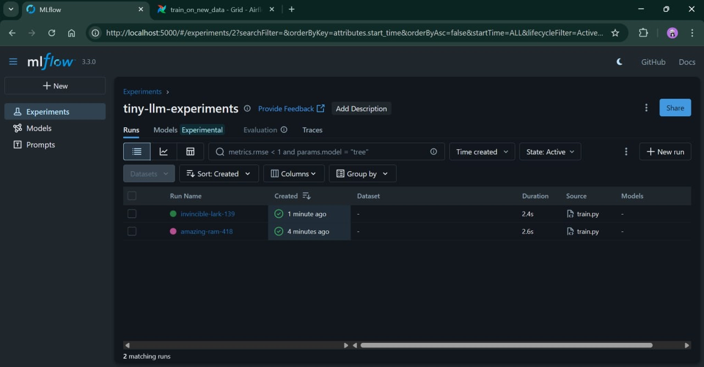

# [Train] RunPod - Training Stacks - Airflow

## Direct deploy Airflow on RunPod
* Setup and install dependencies directly in the RunPod. 
* Airflow Dag testing. 

## Build Airflow & MLflow as docker image
* Build docker image and push into Docker hub.
* Launch a RunPod instance with the custom image from Docker hub. 
* **Issues**: Both services are running but RunPod web terminal not working (reason: might be the image doesn't include the necessary components to support the terminal interface of RunPod). 

## Testing simple flow of trigger the training scripts (Airflow, MLflow on local machine)
* Use docker compose to launch both services.
* Dag scripts to do the task: detect new data → preprocess → start training.

